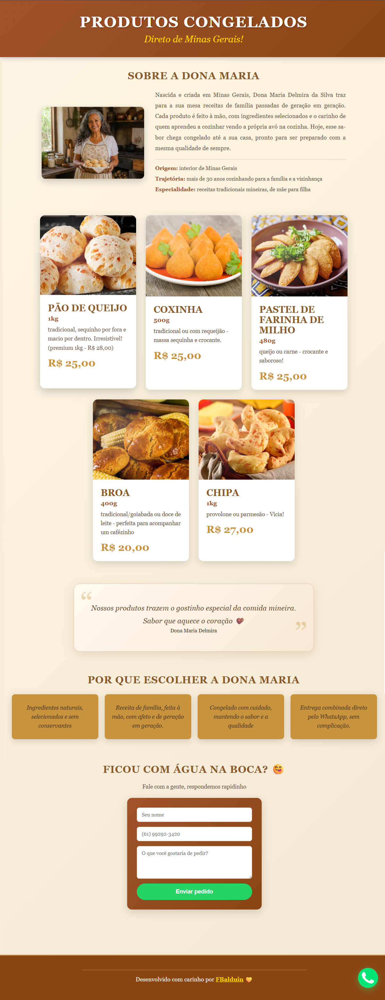
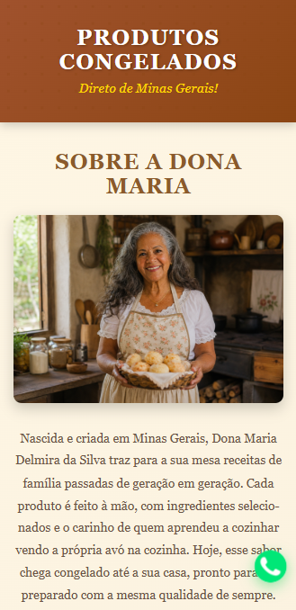

# 🧀 Landing Page - Direto de Minas Gerais

**Instituição:** Senac EAD

**Curso:** Análise e Desenvolvimento de Sistemas (ADS)

**Disciplina:** Fundamentos de Programação Web

**Professor autor:** Bruno de Oliveira


---

## 📋 Sobre a atividade

Landing page desenvolvida para divulgar e facilitar os pedidos dos produtos congelados artesanais de **Dona Maria**, trazendo o sabor e a tradição de Minas Gerais direto para sua casa.

Este projeto foi criado como **Produção Textual Individual (PTI)** para a disciplina de Fundamentos de Programação Web, com o tema **"Landing Page para Autônoma"**.

**Tema:** Landing Page para Autônoma

**Enunciado:** criar uma landing page para uma empresa/profissional autônomo de pequeno porte, com usuários chegando via buscadores ou anúncios em redes sociais. A página deve conter, em uma única tela, pelo menos 5 faixas de conteúdo: sobre a empresa, produtos/serviços oferecidos, vantagens e benefícios, uma chamada para contato através de formulário, e demais informações relevantes. A página deve ser responsiva (desktop e mobile) e construída com HTML, CSS e Flexbox.

**Ramo escolhido:** venda de produtos artesanais congelados (autônoma/vendedora), Dona Maria Delmira da Silva, produtora de comidas típicas mineiras.

### Etapas da atividade

- **Parte A > Prototipação:** escolha do ramo de negócio e planejamento das faixas de conteúdo da página.
- **Parte B > Implementação:** desenvolvimento do site em HTML e CSS puros, com técnicas de layout responsivo (Flexbox + Media Queries).

### Entrega

- Publicação do site em plataforma de hospedagem gratuita.
- Envio do projeto completo em `.zip`, junto com o link do site publicado, no item de Produção Textual Individual da disciplina.

---

## ✅ Como a página atende aos requisitos do enunciado

A página é dividida em **5 faixas de conteúdo**, conforme pedido:

| #   | Faixa                                                                                  | Requisito atendido                                                                              |
| --- | -------------------------------------------------------------------------------------- | ----------------------------------------------------------------------------------------------- |
| 1   | **Sobre a Dona Maria** (`.sobre`), com foto e texto lado a lado                        | Fala sobre a empresa/autônoma                                                                   |
| 2   | **Nossos Produtos** (`.produtos`)                                                      | Produtos/serviços oferecidos, com preços                                                        |
| 3   | **Citação de Dona Maria** (`.depoimento`)                                              | Reforço de identidade/depoimento, informação adicional relevante                                |
| 4   | **Por que escolher a Dona Maria** (`.vantagens`)                                       | Vantagens e benefícios                                                                          |
| 5   | **Fale com a gente + CTA flutuante do WhatsApp** (`.contato-form` + `.whatsapp-float`) | Chamada para contato através de **formulário**, complementada por um CTA direto para o WhatsApp |

Além disso, o cabeçalho (`header`), o rodapé (`footer`) e o botão flutuante do WhatsApp reforçam a identidade da marca e oferecem um canal extra de contato.

---

## ✨ Funcionalidades

- 📸 Catálogo visual com 5 produtos e preços: pão de queijo, broa, coxinha, pastel e chipa, agora com título de seção próprio ("Nossos Produtos").
- 🧑🏽‍🍳 Foto (com efeito de zoom ao passar o mouse) e apresentação de Dona Maria na faixa "Sobre", com texto justificado e uma lista de detalhes (origem, trajetória, especialidade).
- 💬 Citação/depoimento de Dona Maria, estilizado com aspas decorativas de abertura e fechamento.
- 🎨 Cards de "Vantagens" com fundo dourado e tipografia serifada em itálico, visual mais clássico, sem ícones.
- 📝 Formulário de contato (nome, telefone, mensagem):
  - **Máscara de telefone em tempo real**, formatando automaticamente para `(XX) XXXXX-XXXX` enquanto a pessoa digita, e limitando a 11 dígitos (DDD + celular), evita números incompletos ou com dígitos a mais.
  - **Envio direto para o WhatsApp**, montando a mensagem com nome, telefone e pedido e abrindo o `wa.me` em nova aba.
  - **Modal de sucesso customizado** ao enviar o pedido (em vez do alerta padrão do navegador), com as mesmas cores do site; a página recarrega automaticamente ao clicar em "OK".
- 💚 Botão flutuante de WhatsApp (com imagem própria, recortada em círculo), fixo no canto da tela, como chamada rápida de contato.
- 📱 Design responsivo (mobile-first), adaptado para qualquer tela.
- 🧭 Layout em Flexbox (produtos e vantagens quebram e se centralizam automaticamente em qualquer quantidade de itens por linha).
- 🌿 Efeitos sutis de hover e transições suaves.
- ♿ Créditos do rodapé com fonte ampliada e link sublinhado, para melhor leitura por pessoas com baixa visão.
- 🎨 Paleta de cores inspirada em tons terrosos e dourados, remetendo à tradição mineira.

---

## 🖼️ Capturas de Tela

### 💻 Versão Desktop



### 📱 Versão Mobile



---

## 🛠️ Tecnologias Utilizadas

- **HTML5**, estrutura da página.
- **CSS3**, estilos e responsividade.
- **Flexbox**, organização das faixas de sobre, produtos, vantagens e formulário.
- **Media Queries**, adaptação para telas menores.
- **JavaScript** (`script.js`), usado apenas para três recursos pontuais que o CSS puro não resolve sozinho: a máscara de telefone em tempo real, o envio do pedido para o WhatsApp e o modal de sucesso do formulário (com o recarregamento da página ao confirmar). O restante da página não depende de JavaScript para funcionar.

---

## 📁 Estrutura de Arquivos

```
landing-dona-maria/
├── index.html
├── style.css
├── script.js
├── README.md
├── .gitattributes
└── assets/
    ├── pao-de-queijo.jpg
    ├── coxinha.jpg
    ├── pastel.webp
    ├── broa.jpg
    ├── chipa.jpg
    ├── maria_delmira.png
    ├── logo-maria.png
    ├── whatsapp.jpg
    ├── desktop-preview.png
    ├── mobile-preview.png
    └── preview.jpg
```

---

## 🔡 Padronização de quebra de linha (.gitattributes)

O projeto inclui um arquivo `.gitattributes` com a regra `* text=auto`, que padroniza como o Git trata quebras de linha (`LF`/`CRLF`) entre diferentes sistemas operacionais. Sem esse arquivo, o Git costuma exibir avisos do tipo `warning: LF will be replaced by CRLF` ao adicionar arquivos em ambientes Windows, isso não indica nenhum problema no código, apenas uma diferença de convenção entre sistemas, mas o `.gitattributes` evita que o aviso apareça, deixando o comportamento explícito e consistente para qualquer pessoa que clonar o repositório.

---

## 🚀 Como Executar o Projeto Localmente

1. Clone o repositório ou extraia o `.zip`:
   ```
   git clone https://github.com/DevFaBGirl/landing-dona-maria.git
   ```
2. Confirme que as imagens estão na pasta `/assets` com os nomes indicados na estrutura de arquivos acima.
3. Abra o projeto localmente:
   - Use o Live Server do VS Code (recomendado, já que o `script.js` depende de carregamento via servidor local em alguns navegadores), ou
   - Clique duas vezes em `index.html`.
4. Pronto! A página estará disponível no navegador.

---

## 🌐 Publicação (Deploy)

O projeto está publicado gratuitamente na **Vercel**:

🔗 **Site publicado:** https://landing-dona-maria.vercel.app/

### Como foi publicado

1. Repositório do projeto conectado à conta da Vercel.
2. Deploy automático a partir da branch principal, qualquer novo commit atualiza o site publicado.
3. Nenhuma configuração de build adicional é necessária, pois o projeto é um site estático (HTML, CSS e um pequeno script JS).

---

## 🧾 Catálogo de Produtos

| Produto                       | Peso               | Variações                              | Preço    |
| ----------------------------- | ------------------ | -------------------------------------- | -------- |
| 🧀 Pão de Queijo              | 1kg (500g premium) | Tradicional                            | R$ 25,00 |
| 🍗 Coxinha                    | 500g               | Tradicional / Requeijão                | R$ 25,00 |
| 🥟 Pastel de Farinha de Milho | 480g               | Queijo / Carne                         | R$ 25,00 |
| 🍪 Broa                       | 400g               | Tradicional / Goiabada / Doce de Leite | R$ 20,00 |
| 🧈 Chipa                      | 1kg                | Provolone / Parmesão                   | R$ 27,00 |

---

## ⚙️ Personalização

### 🔢 Alterar número do WhatsApp

O número está em dois lugares: no botão flutuante (`index.html`) e no envio do formulário (`script.js`).

```html
<a href="https://wa.me/55110000000?text=..." class="whatsapp-float"></a>
```

```js
const url = `https://wa.me/55110000000?text=${encodeURIComponent(texto)}`;
```

Substitua pelo desejado, no formato: `55` + DDD + número (sem espaços ou símbolos).

### 💰 Atualizar preços

Edite os valores dentro das tags:

```html
<p class="product-price">R$ 25,00</p>
```

### 🖼️ Trocar imagens

Substitua os arquivos dentro da pasta `/assets` mantendo os mesmos nomes, ou altere o caminho no atributo `src` das imagens no HTML.

### 📞 Máscara de telefone

A formatação `(XX) XXXXX-XXXX` está no `script.js`, no bloco que escuta o evento `input` do campo `#telefone`. Ela sempre limita a 11 dígitos (2 do DDD + 9 do celular), para números de telefone fixo (10 dígitos) seria necessário ajustar essa lógica.

### 📝 Formulário de contato

Ao enviar, o site monta o texto `Olá Dona Maria! Meu nome é [nome] [telefone]. [pedido]` e abre o WhatsApp em nova aba, além de exibir o modal de sucesso. O campo de telefone usa exemplo genérico `(61) 99999-9999` como placeholder.

---

## 📱 Responsividade

- 💻 **Desktop:** foto e texto da seção "Sobre" lado a lado; produtos e vantagens organizados em linhas de Flexbox, quebrando conforme o espaço disponível.
- 📱 **Mobile:** foto e texto do "Sobre" empilham e centralizam, com a foto ocupando a largura total (mesmo tamanho das fotos dos produtos); cards de produtos a 100% da largura; cards de vantagens em grid de 2 colunas; botão flutuante do WhatsApp menor e reposicionado mais para cima, para não sobrepor os créditos do rodapé.
- 💡 **Tablet:** adaptação automática com quebra fluida de colunas, sem necessidade de breakpoint adicional.

---

## 📝 Changelog

### Adaptação para o PTI (versão inicial)

- ➕ Adicionada a faixa **"Sobre"** (requisito: falar sobre a empresa).
- ➕ Adicionada a faixa **"Vantagens e benefícios"** com cards em Flexbox.
- ➕ Adicionado **formulário de contato**, requisito explícito do enunciado.
- 🧹 Removida regra de CSS morta (`grid-template-columns` em um container que usa `display: flex`).
- 🧹 Corrigida duplicação de tag `</footer>` no HTML original.

### Segunda rodada (troca de identidade e refinamentos visuais)

- ✏️ Nome do negócio trocado de **Ester** para **Dona Maria Delmira da Silva** (nome completo na seção "Sobre", "Dona Maria" nas demais faixas).
- 🖼️ Faixa "Sobre" reestruturada: foto ao lado do texto, maior, com efeito de zoom ao passar o mouse, e uma lista de detalhes extras (origem, trajetória, especialidade).
- 💬 Frase de destaque movida do topo da página para uma citação estilizada (`.depoimento`) entre Produtos e Vantagens, com aspas decorativas de abertura e fechamento.
- 🎨 Cards de "Vantagens" redesenhados: fundo dourado (`#c9933e`), sem ícones, tipografia serifada em itálico, formato mais retangular.
- ↔️ Espaçamento aumentado entre as faixas de Produtos e Vantagens.
- 🗑️ Caixa de CTA (`.cta-section`) removida por completo, substituída por um **botão flutuante do WhatsApp** com imagem própria recortada em círculo.
- 🎨 Fundo do formulário de contato trocado para o gradiente que antes era usado na CTA.
- ♿ Fonte do crédito no rodapé aumentada (0.9em → 1.2em) e link sublinhado, para melhor leitura por pessoas com baixa visão.
- 📖 Texto da seção "Sobre" justificado, para um bloco de leitura mais organizado.

### Terceira rodada (JavaScript e usabilidade do formulário)

- ➕ Adicionado **`script.js`** como arquivo separado (antes o script ficava embutido no HTML), carregado no fim do `<body>`.
- 📞 Implementada **máscara de telefone**: o campo formata automaticamente para `(XX) XXXXX-XXXX` enquanto a pessoa digita, limitando a 11 dígitos.
- ✅ Implementado **modal de sucesso customizado** ao enviar o formulário, substitui o `alert()` nativo do navegador (que não pode ser estilizado), usando as cores do site. A página recarrega automaticamente ao clicar em "OK", o que também limpa os campos preenchidos.
- 🧪 Testadas e descartadas duas alternativas ao longo do processo: uma mensagem de sucesso 100% em CSS (truque de checkbox + label) e elementos decorativos de canto (`decor-milho.png`/`decor-farinha.png`), ambas foram substituídas pelas soluções finais acima, por oferecerem melhor resultado visual e funcional.

### Quarta rodada (ajustes de publicação e ambiente Git)

- 🔗 URL de publicação atualizada de `produtos-da-maria.vercel.app` para `landing-dona-maria.vercel.app`, refletida no `index.html` (tags Open Graph/Twitter) e no `README.md`.
- ➕ Adicionado **`.gitattributes`** (`* text=auto`), para padronizar quebras de linha entre sistemas operacionais e evitar avisos do Git ao adicionar arquivos.

### Quinta rodada (ajustes finos de responsividade e conteúdo)

- 🏷️ Adicionado título de seção "Nossos Produtos" (`.section-title`) antes do catálogo, deixando essa faixa identificada da mesma forma que as demais.
- 📱 Cards de "Vantagens" reorganizados no mobile em grid de 2 colunas, em vez de empilhados em coluna única.
- 🔡 Rodapé com fonte dos créditos reduzida e espaçamento vertical ajustado, para ficar mais centralizado.
- 💬 Citação com aspas decorativas ajustadas no mobile, para não sobrepor o texto em telas estreitas.

### Sexta rodada (integração com WhatsApp)

- 🔢 Número do WhatsApp atualizado para `61 99292-3420` (botão flutuante + envio do formulário).
- 💬 Formulário passa a abrir o `wa.me` com nome, telefone e pedido, além do modal de sucesso.
- 🔡 Placeholder do telefone trocado para exemplo genérico `(61) 99999-9999`.

---

## 🧡 Créditos e Inspiração

Este projeto é uma homenagem à minha avó, Maria Delmira da Silva, pela força com que abriu caminho para meu pai e para mim, e por todo o carinho, cuidado e afeto que me dedicou a vida inteira. Amo você infinitamente, voínha. Salve sua força ancestral, sei que sempre estará comigo. Gratidão por tanto🌿

## 👩🏽‍💻 Autora

Desenvolvido por **FBalduin**
🔗 GitHub: [github.com/DevFaBGirl](https://github.com/DevFaBGirl)

## 📜 Licença

Sinta-se livre para usar e adaptar para fins pessoais ou educacionais.